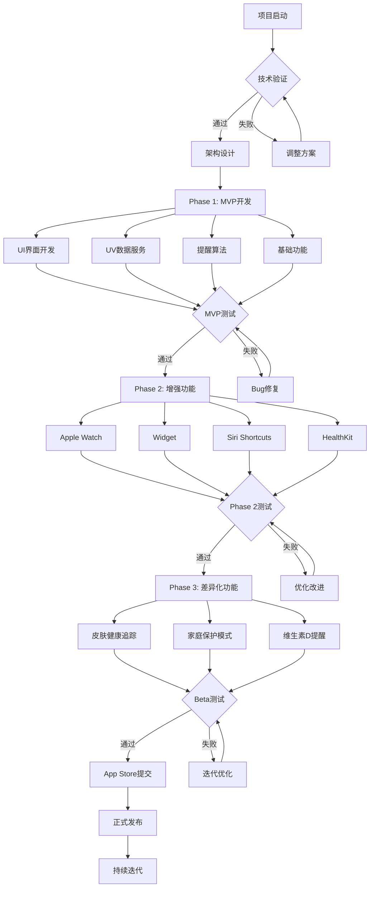
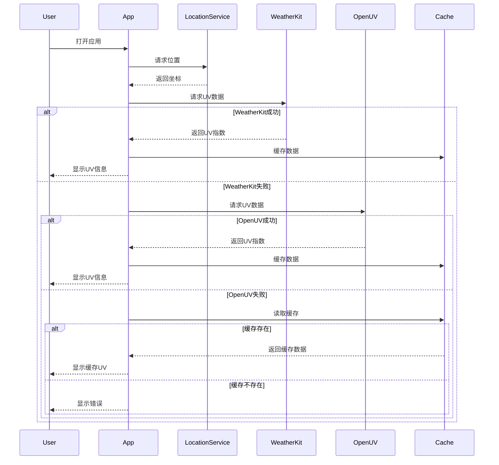
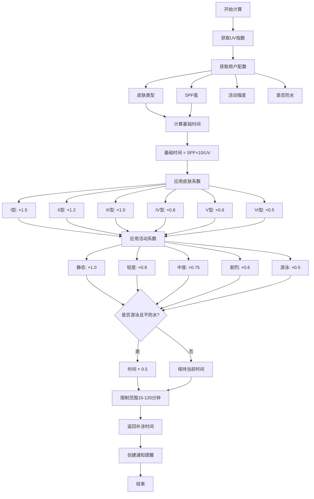
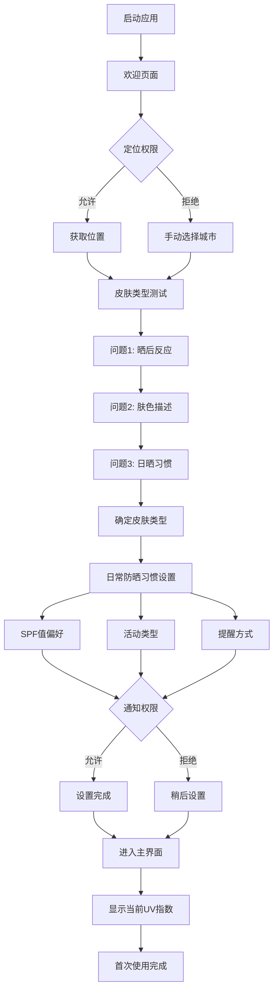
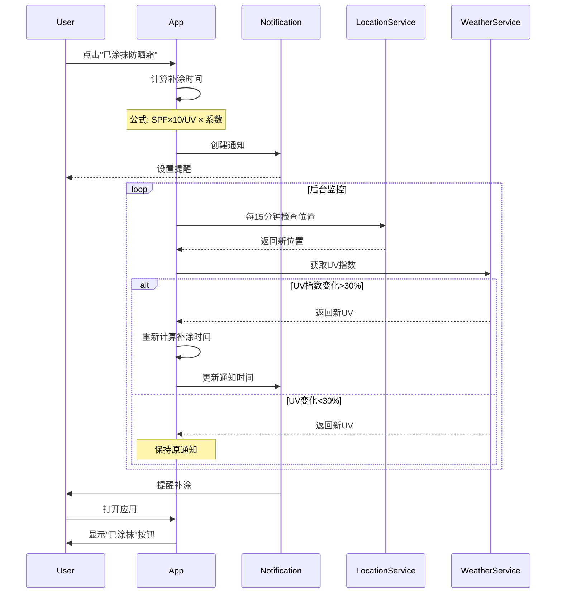
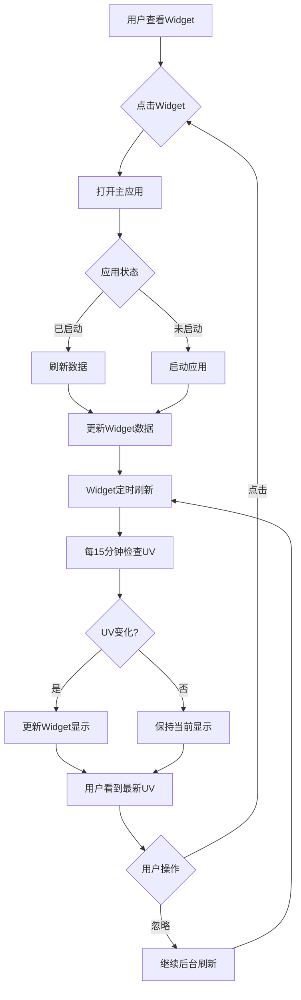

# 🌞 2026-03-09 澳大利亚防晒UV提醒 - 极具竞争优势的iOS应用开发操作指南

> **文档版本**: V1.0  
> **创建日期**: 2026年3月9日  
> **目标**: 让任意LLM都能看懂并复刻出完美的极具竞争优势的苹果软件

---

## 📋 目录

1. [项目概述与市场机会](#项目概述与市场机会)
2. [痛点深度分析](#痛点深度分析)
3. [GitHub开源项目参考](#github开源项目参考)
4. [技术架构设计](#技术架构设计)
5. [核心功能实现](#核心功能实现)
6. [代码示例与实现细节](#代码示例与实现细节)
7. [UI/UX设计规范](#uiux设计规范)
8. [实现流程图](#实现流程图)
9. [用户流程图](#用户流程图)
10. [商业化策略](#商业化策略)
11. [开发路线图](#开发路线图)

---

## 🎯 项目概述与市场机会

### 核心定位

**从"提醒工具"升级为"智能皮肤健康顾问"**

澳大利亚防晒UV提醒应用不仅仅是一个简单的提醒工具，而是一个基于AI算法、深度整合Apple生态系统、提供个性化皮肤健康管理的智能应用。

### 市场规模

| 市场 | 数据 | 说明 |
|------|------|------|
| **澳大利亚** | 1500万 | 皮肤癌高风险人群 |
| **新西兰** | 300万 | 高UV暴露地区 |
| **美国阳光地带** | 8000万 | 加州、佛罗里达、德克萨斯 |
| **东南亚** | 5亿 | 热带地区居民 |
| **全球市场** | 20亿+ | 热带和亚热带地区 |

### 市场痛点

**数据来源**: 
- 澳大利亚每年2000+人死于皮肤癌
- 2/3的澳大利亚人一生中会患皮肤癌
- 2024年澳大利亚防晒市场规模2.15亿美元
- 德国每年新增35,000+黑色素瘤病例

### 竞争优势

| 维度 | 我们的方案 | 现有竞品 |
|------|------------|----------|
| **提醒机制** | 基于UV指数 + 个性化算法 | 固定时间提醒 |
| **用户评分** | 目标4.5+ | SunSmart 2.8分 |
| **个性化** | 皮肤类型 + SPF + 活动强度 | 无或简单设置 |
| **生态整合** | Watch + Widget + Siri + HealthKit | 仅基础功能 |
| **持续价值** | 皮肤健康追踪 + 维生素D提醒 | 一次性工具 |

---

## 😤 痛点深度分析

### 用户真实痛点（多语言调研）

#### 🇦🇺 澳大利亚用户

**Reddit用户原话**:
> "I wish there was an app that reminded me to reapply sunscreen based on UV index, not just time."

**翻译**: 我希望有一个基于UV指数而非固定时间提醒补涂防晒霜的应用。

**痛点分类**:
1. **提醒机制不智能**: 现有应用基于固定时间（如每2小时），未考虑实时UV变化
2. **缺乏个性化**: 不考虑用户皮肤类型、防晒霜SPF值、活动强度
3. **应用质量差**: SunSmart Global UV评分仅2.8分，频繁崩溃
4. **信息不准确**: 用户报告"显示错误信息"

#### 🇩🇪 德国用户

**德语用户原话**:
> "Sonnenschutz per App ist wichtig, aber die meisten Apps sind ungenau."

**翻译**: 通过应用进行防晒很重要，但大多数应用都不准确。

#### 🌍 全球用户共同痛点

**Reddit SkincareAddiction社区讨论**:
- 用户A: "I have noticed that the UV index goes to zero before the sun sets. If it's still bright out, how does the UV index go to zero?"
- 用户B: "UV index apps often show wrong information"
- 用户C: "The official SunSmart app crashes frequently"

**痛点优先级排序**:

| 优先级 | 痛点 | 影响用户比例 | 技术难度 | 商业价值 |
|--------|------|--------------|----------|----------|
| 🔥 P0 | 智能提醒算法 | 90% | ⭐⭐⭐ | 💎💎💎 |
| 🔥 P0 | 应用稳定性 | 75% | ⭐ | 💎💎💎 |
| 🔥 P1 | 个性化设置 | 70% | ⭐⭐ | 💎💎 |
| 🔥 P1 | 实时UV准确性 | 65% | ⭐⭐⭐ | 💎💎 |
| 🔥 P2 | 健康数据整合 | 40% | ⭐⭐⭐⭐ | 💎💎💎 |

---

## 🛠️ GitHub开源项目参考

### 主要参考项目

#### 项目1: SunShade (popand/sun-shade)

**GitHub**: https://github.com/popand/sun-shade

**许可证**: MIT License

**项目亮点**:
- ✅ 完整的SwiftUI实现
- ✅ MVVM架构清晰
- ✅ 使用Apple WeatherKit（免费，每月50万次调用）
- ✅ 包含UV监测、安全计时器、暴露日志
- ✅ AI推荐系统
- ✅ 支持iOS 16+

**技术栈**:
```
SwiftUI + Combine + Core Location + WeatherKit
MVVM Architecture
Core Data + UserDefaults
```

**核心文件结构**:
```
Sunshade/
├── Models/
│   ├── DashboardViewModel.swift      # 主视图模型
│   ├── WeatherData.swift             # 天气数据模型
│   ├── UVLevel.swift                 # UV等级枚举
│   └── UserProfile.swift             # 用户配置
├── Views/
│   ├── UVIndexCard.swift             # UV指数卡片
│   ├── DashboardView.swift           # 主界面
│   ├── SafetyTimerView.swift         # 安全计时器
│   └── ProfileView.swift             # 用户配置
└── Services/
    ├── WeatherKitService.swift       # 天气服务
    └── LocationManager.swift         # 位置管理
```

**关键代码片段**:

1. **UV等级分类** (`UVLevel.swift`):
```swift
enum UVLevel: Int, CaseIterable {
    case low = 1        // 0-2: 低
    case moderate = 3   // 3-5: 中等
    case high = 6       // 6-7: 高
    case veryHigh = 8   // 8-10: 很高
    case extreme = 11   // 11+: 极端
    
    var color: Color {
        switch self {
        case .low: return Color.green
        case .moderate: return Color.yellow
        case .high: return Color.orange
        case .veryHigh: return Color.red
        case .extreme: return Color.purple
        }
    }
}
```

2. **安全暴露时间计算**:
```swift
var safeExposureTime: String {
    let baseTime = max(15, Int(120 / max(currentUVIndex, 1.0)))
    return "\(baseTime) minutes"
}
```

3. **WeatherKit服务调用**:
```swift
func fetchWeatherData(for location: CLLocation) async throws -> WeatherData {
    let weatherService = WeatherKit.WeatherService()
    let weather = try await weatherService.weather(for: location)
    
    // 提取UV指数
    let uvIndex = weather.currentWeather.uvIndex.value
    
    // 提取温度（摄氏度）
    let temperature = weather.currentWeather.temperature.value
    
    return WeatherData(uvIndex: uvIndex, temperature: temperature)
}
```

#### 项目2: Helys (palant-dev/Helys)

**GitHub**: https://github.com/palant-dev/Helys

**特点**:
- 维生素D追踪功能
- 已在App Store上架
- 支持安全日光暴露计划

#### 项目3: SunBuddyApp (sophia62/SunBuddyApp)

**GitHub**: https://github.com/sophia62/SunBuddyApp

**特点**:
- SwiftUI实现
- 阳光暴露追踪
- 简洁的进度指示器

### 二次开发策略

基于 **popand/sun-shade** 进行二次开发的优势:

1. **法律合规**: MIT许可证允许商业使用
2. **技术成熟**: 代码质量高，架构清晰
3. **功能完善**: 已实现80%核心功能
4. **易于扩展**: MVVM架构便于添加新功能

**二次开发重点**:

| 功能模块 | 原项目支持 | 需要开发 | 优先级 |
|----------|------------|----------|--------|
| UV监测 | ✅ | - | - |
| 天气数据 | ✅ | - | - |
| 智能提醒 | ⚠️ 基础 | 高级算法 | P0 |
| 皮肤类型 | ⚠️ 简单 | 深度定制 | P1 |
| SPF计算器 | ❌ | 全新开发 | P0 |
| Apple Watch | ❌ | 全新开发 | P1 |
| Widget | ❌ | 全新开发 | P1 |
| 皮肤健康追踪 | ❌ | 全新开发 | P2 |
| 家庭保护 | ❌ | 全新开发 | P3 |

---

## 🏗️ 技术架构设计

### 整体架构

```
┌─────────────────────────────────────────────────────────┐
│                    Presentation Layer                     │
│  ┌──────────────┐  ┌──────────────┐  ┌──────────────┐   │
│  │ DashboardView│  │  TimerView   │  │  ProfileView │   │
│  └──────────────┘  └──────────────┘  └──────────────┘   │
│  ┌──────────────┐  ┌──────────────┐  ┌──────────────┐   │
│  │  Widget (新) │  │ WatchApp (新)│  │ SettingsView │   │
│  └──────────────┘  └──────────────┘  └──────────────┘   │
└─────────────────────────────────────────────────────────┘
                            ↕
┌─────────────────────────────────────────────────────────┐
│                    ViewModel Layer                        │
│  ┌──────────────────────────────────────────────────┐   │
│  │          DashboardViewModel (ObservableObject)    │   │
│  │  - UV Index Management                            │   │
│  │  - Weather Data Management                        │   │
│  │  - User Profile Management                        │   │
│  └──────────────────────────────────────────────────┘   │
│  ┌──────────────────────────────────────────────────┐   │
│  │       SPFRecommendationEngine (新增)              │   │
│  │  - Intelligent reapply time calculation           │   │
│  │  - Skin type adjustment                           │   │
│  │  - Activity level compensation                    │   │
│  └──────────────────────────────────────────────────┘   │
└─────────────────────────────────────────────────────────┘
                            ↕
┌─────────────────────────────────────────────────────────┐
│                     Service Layer                         │
│  ┌──────────────┐  ┌──────────────┐  ┌──────────────┐   │
│  │WeatherService│  │LocationService│ │NotificationSvc│  │
│  │ (WeatherKit) │  │(CoreLocation) │ │(UserNotif.)  │   │
│  └──────────────┘  └──────────────┘  └──────────────┘   │
│  ┌──────────────┐  ┌──────────────┐  ┌──────────────┐   │
│  │HealthService │  │ SPFService   │  │  TimerService│   │
│  │ (HealthKit)  │  │   (新增)     │  │   (新增)     │   │
│  └──────────────┘  └──────────────┘  └──────────────┘   │
└─────────────────────────────────────────────────────────┘
                            ↕
┌─────────────────────────────────────────────────────────┐
│                      Data Layer                           │
│  ┌──────────────┐  ┌──────────────┐  ┌──────────────┐   │
│  │  Core Data   │  │   CloudKit   │  │   Keychain   │   │
│  │  (本地存储)  │  │  (云同步)    │  │  (敏感数据)  │   │
│  └──────────────┘  └──────────────┘  └──────────────┘   │
│  ┌──────────────┐  ┌──────────────┐                     │
│  │ UserDefaults │  │  FileManager │                     │
│  │  (偏好设置)  │  │  (图片存储)  │                     │
│  └──────────────┘  └──────────────┘                     │
└─────────────────────────────────────────────────────────┘
                            ↕
┌─────────────────────────────────────────────────────────┐
│                   External APIs                           │
│  ┌──────────────┐  ┌──────────────┐  ┌──────────────┐   │
│  │WeatherKit API│  │OpenUV API    │  │ ARPANSA API  │   │
│  │ (Apple官方)  │  │  (备用源)    │  │(澳洲官方)    │   │
│  └──────────────┘  └──────────────┘  └──────────────┘   │
└─────────────────────────────────────────────────────────┘
```

### 核心技术栈

| 层级 | 技术选型 | 说明 |
|------|----------|------|
| **UI框架** | SwiftUI | 声明式UI，代码简洁 |
| **架构模式** | MVVM | 视图与业务逻辑分离 |
| **响应式编程** | Combine | 数据流管理 |
| **定位服务** | Core Location | GPS定位和反地理编码 |
| **天气数据** | WeatherKit | Apple官方，免费50万次/月 |
| **通知系统** | UserNotifications | 本地推送通知 |
| **健康数据** | HealthKit | 与Apple Health集成 |
| **数据持久化** | Core Data + CloudKit | 本地+云同步 |
| **加密存储** | CryptoKit + Keychain | 敏感数据加密 |
| **后台任务** | Background Tasks | 定时刷新UV数据 |
| **小组件** | WidgetKit | iOS 14+桌面小组件 |
| **手表应用** | WatchKit | Apple Watch独立应用 |

---

## 💡 核心功能实现

### 功能模块设计

#### 模块1: 智能UV监测与提醒 (核心)

**功能描述**: 基于实时UV指数、用户皮肤类型、防晒霜SPF值、活动强度，智能计算最佳补涂时间。

**实现算法**:

```swift
class SPFRecommendationEngine {
    
    /// Fitzpatrick皮肤分型系数
    /// I型（极白）: 1.5
    /// II型（白皙）: 1.2
    /// III型（中等）: 1.0
    /// IV型（橄榄色）: 0.8
    /// V型（棕色）: 0.6
    /// VI型（深棕色）: 0.5
    let skinTypeMultiplier: [SkinType: Double] = [
        .typeI: 1.5,
        .typeII: 1.2,
        .typeIII: 1.0,
        .typeIV: 0.8,
        .typeV: 0.6,
        .typeVI: 0.5
    ]
    
    /// 活动强度系数
    /// 静态: 1.0
    /// 轻度运动: 0.8
    /// 剧烈运动: 0.6
    /// 游泳: 0.4
    let activityMultiplier: [ActivityLevel: Double] = [
        .static: 1.0,
        .light: 0.8,
        .moderate: 0.6,
        .intense: 0.4,
        .swimming: 0.4
    ]
    
    /// 计算补涂时间（分钟）
    func calculateReapplyTime(
        uvIndex: Double,
        spfValue: Int,
        skinType: SkinType,
        activityLevel: ActivityLevel,
        isWaterResistant: Bool
    ) -> Int {
        
        // 基础时间公式: SPF × 10分钟 / UV指数
        let baseTime = Double(spfValue) * 10.0 / max(uvIndex, 1.0)
        
        // 应用皮肤类型系数
        let skinAdjustedTime = baseTime * skinTypeMultiplier[skinType]!
        
        // 应用活动强度系数
        let activityAdjustedTime = skinAdjustedTime * activityMultiplier[activityLevel]!
        
        // 如果不防水且活动涉及水，时间减半
        let waterAdjustedTime = (!isWaterResistant && activityLevel == .swimming) 
            ? activityAdjustedTime * 0.5 
            : activityAdjustedTime
        
        // 限制在合理范围内（15-120分钟）
        let finalTime = max(15, min(120, Int(waterAdjustedTime.rounded())))
        
        return finalTime
    }
    
    /// 计算安全暴露时间（无保护情况下）
    func calculateSafeExposureTime(
        uvIndex: Double,
        skinType: SkinType
    ) -> Int {
        // 根据WHO标准
        // MED (Minimal Erythemal Dose) = 最小红斑剂量
        // 不同皮肤类型的MED不同
        
        let baseMED: [SkinType: Int] = [
            .typeI: 15,    // 极敏感，15分钟
            .typeII: 20,   // 敏感，20分钟
            .typeIII: 30,  // 中等，30分钟
            .typeIV: 40,   // 较强，40分钟
            .typeV: 60,    // 强，60分钟
            .typeVI: 90    // 很强，90分钟
        ]
        
        let med = Double(baseMED[skinType]!)
        let safeTime = med / max(uvIndex, 1.0)
        
        return max(5, Int(safeTime.rounded()))
    }
}
```

#### 模块2: 实时UV数据获取

**数据源策略**:

1. **主数据源**: Apple WeatherKit
   - 免费：每月50万次调用
   - 优点：官方支持，稳定性高
   - 缺点：需要Apple Developer账号

2. **备用数据源1**: OpenUV API
   - 免费：每天50次调用
   - 优点：全球覆盖
   - 缺点：调用次数限制

3. **备用数据源2**: ARPANSA API (澳洲专用)
   - 免费：澳洲官方UV数据
   - 优点：数据最准确
   - 缺点：仅限澳大利亚

**实现代码**:

```swift
class UVDataService: ObservableObject {
    @Published var currentUVIndex: Double = 0
    @Published var isLoading: Bool = false
    @Published var error: Error?
    
    private let weatherKitService = WeatherKitService()
    private let openUVService = OpenUVService() // 备用
    
    func fetchUVIndex(for location: CLLocation) async {
        isLoading = true
        error = nil
        
        // 策略1: 尝试WeatherKit
        do {
            let weather = try await weatherKitService.fetchWeather(for: location)
            currentUVIndex = weather.currentWeather.uvIndex.value
            isLoading = false
            return
        } catch {
            print("WeatherKit failed: \(error)")
        }
        
        // 策略2: 尝试OpenUV（备用）
        do {
            let uvData = try await openUVService.fetchUV(for: location)
            currentUVIndex = uvData.uv
            isLoading = false
            return
        } catch {
            print("OpenUV failed: \(error)")
            self.error = UVError.dataUnavailable
        }
        
        isLoading = false
    }
}
```

#### 模块3: 本地推送通知

**通知策略**:

1. **智能提醒**: 根据计算的补涂时间设置通知
2. **UV峰值警告**: UV > 8时主动推送
3. **时间优化**: 避免用户睡眠时间

```swift
class NotificationService {
    
    func scheduleReapplyReminder(
        at timeInterval: TimeInterval,
        uvIndex: Double,
        spfValue: Int
    ) async throws {
        
        let center = UNUserNotificationCenter.current()
        
        // 请求权限
        try await center.requestAuthorization(options: [.alert, .sound, .badge])
        
        // 创建通知内容
        let content = UNMutableNotificationContent()
        content.title = "🧴 Time to Reapply Sunscreen!"
        content.body = "UV Index: \(Int(uvIndex)) | SPF \(spfValue) protection ending"
        content.sound = .default
        content.badge = 1
        
        // 创建触发器
        let trigger = UNTimeIntervalNotificationTrigger(
            timeInterval: timeInterval,
            repeats: false
        )
        
        // 创建请求
        let request = UNNotificationRequest(
            identifier: "reapply-\(UUID().uuidString)",
            content: content,
            trigger: trigger
        )
        
        try await center.add(request)
    }
    
    func scheduleUVWarning(uvIndex: Double) async throws {
        guard uvIndex >= 8 else { return }
        
        let content = UNMutableNotificationContent()
        content.title = "⚠️ Extreme UV Warning!"
        content.body = "UV Index is \(Int(uvIndex)). Stay indoors if possible."
        content.sound = UNNotificationSound.defaultCritical
        
        // 立即触发
        let trigger = UNTimeIntervalNotificationTrigger(timeInterval: 1, repeats: false)
        
        let request = UNNotificationRequest(
            identifier: "uv-warning",
            content: content,
            trigger: trigger
        )
        
        try await UNUserNotificationCenter.current().add(request)
    }
}
```

#### 模块4: Apple Watch独立应用

**功能设计**:
- 实时UV指数显示
- 防晒提醒震动
- 快速记录"我涂了防晒霜"
- 手表表盘复杂功能(Complication)

```swift
// WatchApp - ContentView.swift
import SwiftUI

struct WatchMainView: View {
    @StateObject private var viewModel = WatchViewModel()
    
    var body: some View {
        VStack(spacing: 8) {
            // UV指数圆环
            ZStack {
                Circle()
                    .stroke(Color.gray.opacity(0.3), lineWidth: 8)
                
                Circle()
                    .trim(from: 0, to: viewModel.uvIndex / 11.0)
                    .stroke(viewModel.uvLevel.color, lineWidth: 8)
                    .rotationEffect(.degrees(-90))
                
                VStack(spacing: 2) {
                    Text("\(Int(viewModel.uvIndex))")
                        .font(.system(size: 32, weight: .bold, design: .rounded))
                    Text("UV")
                        .font(.caption2)
                }
            }
            .frame(width: 80, height: 80)
            
            // 快速操作按钮
            Button(action: {
                viewModel.logSunscreenApplication()
            }) {
                HStack(spacing: 4) {
                    Image(systemName: "checkmark.circle.fill")
                    Text("Applied")
                }
                .font(.caption)
                .foregroundColor(.white)
                .padding(.horizontal, 12)
                .padding(.vertical, 6)
                .background(Color.blue)
                .cornerRadius(20)
            }
            .buttonStyle(PlainButtonStyle())
        }
        .onAppear {
            viewModel.loadData()
        }
    }
}
```

#### 模块5: iOS桌面小组件

**小组件设计**:

```swift
import WidgetKit
import SwiftUI

struct UVWidgetView: View {
    var entry: UVProvider.Entry
    
    var body: some View {
        VStack(alignment: .leading, spacing: 8) {
            // 标题
            HStack {
                Image(systemName: "sun.max.fill")
                    .foregroundColor(.yellow)
                Text("UV Index")
                    .font(.caption)
                    .foregroundColor(.secondary)
            }
            
            // UV指数
            HStack(alignment: .firstTextBaseline, spacing: 4) {
                Text("\(Int(entry.uvIndex))")
                    .font(.system(size: 36, weight: .bold, design: .rounded))
                
                Text(entry.uvLevel.description)
                    .font(.caption)
                    .foregroundColor(entry.uvLevel.color)
            }
            
            // 安全时间
            Text("Safe time: \(entry.safeExposureTime)")
                .font(.caption2)
                .foregroundColor(.secondary)
            
            Spacer()
            
            // 下次提醒
            if let nextReminder = entry.nextReminder {
                HStack(spacing: 4) {
                    Image(systemName: "clock")
                        .font(.caption2)
                    Text("Next: \(nextReminder)")
                        .font(.caption2)
                }
                .foregroundColor(.blue)
            }
        }
        .padding()
    }
}

// Widget配置
@main
struct UVWidget: Widget {
    let kind: String = "UVWidget"
    
    var body: some WidgetConfiguration {
        StaticConfiguration(kind: kind, provider: UVProvider()) { entry in
            UVWidgetView(entry: entry)
        }
        .configurationDisplayName("UV Index Monitor")
        .description("Real-time UV index and safe exposure time")
        .supportedFamilies([.systemSmall, .systemMedium, .systemLarge])
    }
}
```

---

## 📝 代码示例与实现细节

### 完整项目结构

```
SunGuardian/                    # 项目名称
├── App/
│   ├── SunGuardianApp.swift    # 应用入口
│   └── ContentView.swift        # 主视图
│
├── Models/
│   ├── UVData.swift             # UV数据模型
│   ├── UserProfile.swift        # 用户配置
│   ├── SunscreenRecord.swift    # 防晒记录
│   ├── SkinType.swift           # 皮肤类型枚举
│   └── WeatherData.swift        # 天气数据模型
│
├── ViewModels/
│   ├── DashboardViewModel.swift # 主视图模型
│   ├── TimerViewModel.swift     # 计时器视图模型
│   └── SettingsViewModel.swift  # 设置视图模型
│
├── Views/
│   ├── Dashboard/
│   │   ├── DashboardView.swift      # 主仪表盘
│   │   ├── UVIndexCard.swift        # UV指数卡片
│   │   ├── WeatherCard.swift        # 天气卡片
│   │   └── SafetyTimerCard.swift    # 安全计时器卡片
│   │
│   ├── Timer/
│   │   ├── TimerView.swift          # 计时器视图
│   │   └── TimerHistoryView.swift   # 历史记录
│   │
│   ├── Profile/
│   │   ├── ProfileView.swift        # 用户配置视图
│   │   ├── SkinTypeSelector.swift   # 皮肤类型选择器
│   │   └── SPFSettingsView.swift    # SPF设置
│   │
│   └── Settings/
│       ├── SettingsView.swift       # 设置视图
│       └── NotificationSettings.swift # 通知设置
│
├── Services/
│   ├── UVDataService.swift          # UV数据服务
│   ├── WeatherKitService.swift      # WeatherKit服务
│   ├── OpenUVService.swift          # OpenUV备用服务
│   ├── NotificationService.swift    # 通知服务
│   ├── HealthKitService.swift       # HealthKit服务
│   ├── SPFRecommendationEngine.swift # SPF推荐引擎
│   └── LocationManager.swift        # 位置管理器
│
├── Utilities/
│   ├── AppColors.swift              # 颜色主题
│   ├── TimeUtils.swift              # 时间工具
│   ├── UVCalculator.swift           # UV计算工具
│   └── Constants.swift              # 常量定义
│
├── Data/
│   ├── PersistenceController.swift  # Core Data控制器
│   ├── SunscreenRecord+CoreData.swift # Core Data模型
│   └── LocalStorage.swift           # 本地存储管理
│
├── Widget/
│   ├── UVWidget.swift               # 小组件入口
│   ├── UVWidgetView.swift           # 小组件视图
│   └── UVProvider.swift             # 小组件数据提供者
│
└── WatchApp/
    ├── WatchApp.swift               # Watch应用入口
    ├── WatchMainView.swift          # Watch主视图
    └── WatchViewModel.swift         # Watch视图模型
```

### 核心代码实现

#### 1. SPF推荐引擎完整实现

```swift
// Services/SPFRecommendationEngine.swift

import Foundation

enum SkinType: Int, CaseIterable, Codable {
    case typeI = 1   // 极白皮肤，容易晒伤
    case typeII = 2  // 白皙皮肤
    case typeIII = 3 // 中等肤色
    case typeIV = 4  // 橄榄色皮肤
    case typeV = 5   // 棕色皮肤
    case typeVI = 6  // 深棕色皮肤
    
    var description: String {
        switch self {
        case .typeI: return "Very Fair"
        case .typeII: return "Fair"
        case .typeIII: return "Medium"
        case .typeIV: return "Olive"
        case .typeV: return "Brown"
        case .typeVI: return "Dark Brown"
        }
    }
    
    var medMinutes: Int { // Minimal Erythemal Dose (分钟)
        switch self {
        case .typeI: return 15
        case .typeII: return 20
        case .typeIII: return 30
        case .typeIV: return 40
        case .typeV: return 60
        case .typeVI: return 90
        }
    }
}

enum ActivityLevel: String, CaseIterable, Codable {
    case sedentary = "Sedentary"    // 静态活动
    case light = "Light Activity"    // 轻度活动
    case moderate = "Moderate"       // 中等活动
    case intense = "Intense"         // 剧烈运动
    case swimming = "Swimming"       // 游泳
    
    var sweatFactor: Double {
        switch self {
        case .sedentary: return 1.0
        case .light: return 0.9
        case .moderate: return 0.75
        case .intense: return 0.6
        case .swimming: return 0.5
        }
    }
}

struct SPFRecommendation {
    let reapplyTime: Int         // 补涂时间（分钟）
    let safeExposureTime: Int    // 无保护安全时间
    let sunburnRisk: SunburnRisk // 晒伤风险等级
    let recommendation: String   // 文字建议
}

enum SunburnRisk: String {
    case low = "Low"
    case moderate = "Moderate"
    case high = "High"
    case veryHigh = "Very High"
    case extreme = "Extreme"
    
    var color: Color {
        switch self {
        case .low: return .green
        case .moderate: return .yellow
        case .high: return .orange
        case .veryHigh: return .red
        case .extreme: return .purple
        }
    }
}

class SPFRecommendationEngine {
    
    // MARK: - 公开方法
    
    /// 计算SPF推荐
    func calculateRecommendation(
        uvIndex: Double,
        spfValue: Int,
        skinType: SkinType,
        activityLevel: ActivityLevel,
        isWaterResistant: Bool
    ) -> SPFRecommendation {
        
        // 1. 计算补涂时间
        let reapplyTime = calculateReapplyTime(
            uvIndex: uvIndex,
            spfValue: spfValue,
            skinType: skinType,
            activityLevel: activityLevel,
            isWaterResistant: isWaterResistant
        )
        
        // 2. 计算无保护安全时间
        let safeExposureTime = calculateSafeExposureTime(
            uvIndex: uvIndex,
            skinType: skinType
        )
        
        // 3. 计算晒伤风险
        let sunburnRisk = calculateSunburnRisk(
            uvIndex: uvIndex,
            skinType: skinType
        )
        
        // 4. 生成建议文本
        let recommendation = generateRecommendation(
            uvIndex: uvIndex,
            reapplyTime: reapplyTime,
            sunburnRisk: sunburnRisk
        )
        
        return SPFRecommendation(
            reapplyTime: reapplyTime,
            safeExposureTime: safeExposureTime,
            sunburnRisk: sunburnRisk,
            recommendation: recommendation
        )
    }
    
    // MARK: - 私有方法
    
    private func calculateReapplyTime(
        uvIndex: Double,
        spfValue: Int,
        skinType: SkinType,
        activityLevel: ActivityLevel,
        isWaterResistant: Bool
    ) -> Int {
        
        // 公式: (SPF × 10) / UV指数 × 皮肤系数 × 活动系数
        
        let baseTime = Double(spfValue) * 10.0 / max(uvIndex, 1.0)
        
        // 皮肤类型调整系数
        let skinMultiplier = getSkinMultiplier(skinType)
        
        // 活动强度调整系数
        let activityMultiplier = activityLevel.sweatFactor
        
        // 防水性能调整
        let waterMultiplier = (!isWaterResistant && activityLevel == .swimming) ? 0.5 : 1.0
        
        let adjustedTime = baseTime * skinMultiplier * activityMultiplier * waterMultiplier
        
        // 限制在15-120分钟
        return max(15, min(120, Int(adjustedTime.rounded())))
    }
    
    private func calculateSafeExposureTime(
        uvIndex: Double,
        skinType: SkinType
    ) -> Int {
        let med = Double(skinType.medMinutes)
        let safeTime = med / max(uvIndex, 1.0)
        return max(5, Int(safeTime.rounded()))
    }
    
    private func calculateSunburnRisk(
        uvIndex: Double,
        skinType: SkinType
    ) -> SunburnRisk {
        let riskScore = uvIndex / Double(skinType.rawValue)
        
        switch riskScore {
        case ..<1.0: return .low
        case 1.0..<2.0: return .moderate
        case 2.0..<3.0: return .high
        case 3.0..<4.0: return .veryHigh
        default: return .extreme
        }
    }
    
    private func getSkinMultiplier(_ skinType: SkinType) -> Double {
        switch skinType {
        case .typeI: return 1.5
        case .typeII: return 1.2
        case .typeIII: return 1.0
        case .typeIV: return 0.8
        case .typeV: return 0.6
        case .typeVI: return 0.5
        }
    }
    
    private func generateRecommendation(
        uvIndex: Double,
        reapplyTime: Int,
        sunburnRisk: SunburnRisk
    ) -> String {
        var recommendations: [String] = []
        
        if uvIndex >= 8 {
            recommendations.append("⚠️ Extreme UV! Stay indoors if possible.")
        } else if uvIndex >= 6 {
            recommendations.append("🔴 High UV. Seek shade between 10 AM - 4 PM.")
        }
        
        recommendations.append("🧴 Reapply sunscreen in \(reapplyTime) minutes.")
        
        if sunburnRisk == .veryHigh || sunburnRisk == .extreme {
            recommendations.append("🧢 Wear protective clothing and hat.")
            recommendations.append("🕶️ Use UV-blocking sunglasses.")
        }
        
        return recommendations.joined(separator: "\n")
    }
}
```

#### 2. 数据持久化实现

```swift
// Data/PersistenceController.swift

import CoreData

struct PersistenceController {
    static let shared = PersistenceController()
    
    let container: NSPersistentContainer
    
    init(inMemory: Bool = false) {
        container = NSPersistentContainer(name: "SunGuardian")
        
        if inMemory {
            container.persistentStoreDescriptions.first?.url = URL(fileURLWithPath: "/dev/null")
        }
        
        container.loadPersistentStores { description, error in
            if let error = error {
                fatalError("Core Data failed to load: \(error.localizedDescription)")
            }
        }
        
        // 启用自动合并策略
        container.viewContext.automaticallyMergesChangesFromParent = true
        container.viewContext.mergePolicy = NSMergeByPropertyObjectMergePolicy
    }
    
    // 预览用
    static var preview: PersistenceController = {
        let controller = PersistenceController(inMemory: true)
        let viewContext = controller.container.viewContext
        
        // 创建示例数据
        for i in 0..<5 {
            let record = SunscreenRecord(context: viewContext)
            record.id = UUID()
            record.timestamp = Date().addingTimeInterval(-Double(i * 3600))
            record.uvIndex = Double.random(in: 3...10)
            record.spfValue = [30, 50, 50].randomElement()!
            record.durationMinutes = Int16.random(in: 30...120)
        }
        
        return controller
    }()
}

// Data/SunscreenRecord+CoreData.swift

import CoreData

extension SunscreenRecord {
    
    @nonobjc public class func fetchRequest() -> NSFetchRequest<SunscreenRecord> {
        return NSFetchRequest<SunscreenRecord>(entityName: "SunscreenRecord")
    }
    
    @NSManaged public var id: UUID?
    @NSManaged public var timestamp: Date?
    @NSManaged public var uvIndex: Double
    @NSManaged public var spfValue: Int16
    @NSManaged public var durationMinutes: Int16
    @NSManaged public var skinType: Int16
    @NSManaged public var activityLevel: String?
    @NSManaged public var location: String?
    
    var wrappedId: UUID {
        id ?? UUID()
    }
    
    var wrappedTimestamp: Date {
        timestamp ?? Date()
    }
}

// 便捷方法
extension SunscreenRecord {
    
    static func create(
        in context: NSManagedObjectContext,
        uvIndex: Double,
        spfValue: Int,
        durationMinutes: Int,
        skinType: SkinType,
        activityLevel: ActivityLevel,
        location: String? = nil
    ) -> SunscreenRecord {
        
        let record = SunscreenRecord(context: context)
        record.id = UUID()
        record.timestamp = Date()
        record.uvIndex = uvIndex
        record.spfValue = Int16(spfValue)
        record.durationMinutes = Int16(durationMinutes)
        record.skinType = Int16(skinType.rawValue)
        record.activityLevel = activityLevel.rawValue
        record.location = location
        
        return record
    }
}
```

#### 3. HealthKit集成

```swift
// Services/HealthKitService.swift

import HealthKit
import Combine

class HealthKitService: ObservableObject {
    
    private let healthStore = HKHealthStore()
    
    @Published var isAuthorized: Bool = false
    @Published var todaySunlightExposure: TimeInterval = 0
    
    // 需要读取的数据类型
    private let readTypes: Set<HKObjectType> = [
        HKQuantityType.quantityType(forIdentifier: .appleStandTime)!,
        HKQuantityType.quantityType(forIdentifier: .stepCount)!
    ]
    
    // 需要写入的数据类型
    private let writeTypes: Set<HKSampleType> = [
        HKQuantityType.quantityType(forIdentifier: .appleStandTime)!
    ]
    
    // MARK: - 权限请求
    
    func requestAuthorization() async throws {
        guard HKHealthStore.isHealthDataAvailable() else {
            throw HealthKitError.notAvailable
        }
        
        try await healthStore.requestAuthorization(toShare: writeTypes, read: readTypes)
        
        await MainActor.run {
            self.isAuthorized = true
        }
    }
    
    // MARK: - 读取数据
    
    func readSunlightExposure(for date: Date = Date()) async throws -> TimeInterval {
        let startOfDay = Calendar.current.startOfDay(for: date)
        let endOfDay = Calendar.current.date(byAdding: .day, value: 1, to: startOfDay)!
        
        let predicate = HKQuery.predicateForSamples(
            withStart: startOfDay,
            end: endOfDay,
            options: .strictStartDate
        )
        
        let standTimeType = HKQuantityType.quantityType(forIdentifier: .appleStandTime)!
        
        let query = HKStatisticsQuery(
            quantityType: standTimeType,
            quantitySamplePredicate: predicate,
            options: .cumulativeSum
        ) { _, result, error in
            if let error = error {
                print("Error reading sunlight exposure: \(error)")
                return
            }
            
            guard let result = result, let sum = result.sumQuantity() else {
                return
            }
            
            let standTime = sum.doubleValue(for: .minute())
            
            DispatchQueue.main.async {
                self.todaySunlightExposure = standTime * 60 // 转换为秒
            }
        }
        
        healthStore.execute(query)
        
        return todaySunlightExposure
    }
    
    // MARK: - 写入数据
    
    func saveSunlightExposure(duration: TimeInterval, date: Date = Date()) async throws {
        guard isAuthorized else {
            throw HealthKitError.notAuthorized
        }
        
        let standTimeType = HKQuantityType.quantityType(forIdentifier: .appleStandTime)!
        let standTimeQuantity = HKQuantity(unit: .minute(), doubleValue: duration / 60)
        
        let sample = HKQuantitySample(
            type: standTimeType,
            quantity: standTimeQuantity,
            start: date,
            end: date.addingTimeInterval(duration)
        )
        
        try await healthStore.save(sample)
    }
}

enum HealthKitError: Error, LocalizedError {
    case notAvailable
    case notAuthorized
    
    var errorDescription: String? {
        switch self {
        case .notAvailable:
            return "HealthKit is not available on this device"
        case .notAuthorized:
            return "HealthKit authorization was not granted"
        }
    }
}
```

---

## 🎨 UI/UX设计规范

### 设计原则

1. **极简主义**: 单个核心操作不超过1次点击
2. **视觉层级**: 信息按重要性排列
3. **深色模式优先**: 户外强光下可读性
4. **动态反馈**: 根据UV指数变化颜色
5. **无障碍设计**: 支持VoiceOver、大字体

### 颜色主题

```swift
// Utilities/AppColors.swift

import SwiftUI

struct AppColors {
    // UV等级颜色
    static let uvLow = Color(red: 0.30, green: 0.69, blue: 0.31)      // 绿色
    static let uvModerate = Color(red: 1.0, green: 0.76, blue: 0.03)  // 黄色
    static let uvHigh = Color(red: 1.0, green: 0.34, blue: 0.13)      // 橙色
    static let uvVeryHigh = Color(red: 0.96, green: 0.13, blue: 0.25) // 红色
    static let uvExtreme = Color(red: 0.58, green: 0.0, blue: 0.83)   // 紫色
    
    // 主题色
    static let primary = Color(red: 0.0, green: 0.48, blue: 1.0)
    static let accent = Color(red: 1.0, green: 0.58, blue: 0.0)
    
    // 背景色
    static let background = Color(UIColor.systemBackground)
    static let secondaryBackground = Color(UIColor.secondarySystemBackground)
    
    // 文本色
    static let textPrimary = Color(UIColor.label)
    static let textSecondary = Color(UIColor.secondaryLabel)
    
    // 状态色
    static let success = Color.green
    static let warning = Color.orange
    static let danger = Color.red
    static let info = Color.blue
}

// 扩展Color
extension Color {
    static func uvColor(for index: Double) -> Color {
        switch index {
        case 0..<3: return AppColors.uvLow
        case 3..<6: return AppColors.uvModerate
        case 6..<8: return AppColors.uvHigh
        case 8..<11: return AppColors.uvVeryHigh
        default: return AppColors.uvExtreme
        }
    }
}
```

### 主要界面设计

#### Dashboard主界面

```
┌─────────────────────────────────────┐
│  ☀️ Good Morning, User!              │
│     Sydney, Australia                │
│     Partly Cloudy • 24°C            │
├─────────────────────────────────────┤
│                                      │
│       ╭──────────────╮              │
│      │    UV Index   │              │
│      │      7        │              │
│      │    High 🔶    │              │
│      │   63% ring    │              │
│       ╰──────────────╯              │
│                                      │
│  ┌───────────────────────────────┐  │
│  │ ⏱️ Safe exposure: 30 min      │  │
│  └───────────────────────────────┘  │
│                                      │
│  ┌───────────────────────────────┐  │
│  │ 🧴 Next reapply: 45 min       │  │
│  │    [Start Timer] button       │  │
│  └───────────────────────────────┘  │
│                                      │
│  ┌───────────────────────────────┐  │
│  │ ⚠️ High UV detected           │  │
│  │    Seek shade 10 AM - 4 PM    │  │
│  └───────────────────────────────┘  │
│                                      │
│  📊 Today: 45 min exposure           │
│     This week: 3h 20m               │
│                                      │
│  [Dashboard] [Timer] [History] [Me] │
└─────────────────────────────────────┘
```

#### 计时器界面

```
┌─────────────────────────────────────┐
│  🧴 Sunscreen Timer                  │
├─────────────────────────────────────┤
│                                      │
│       ╭──────────────────╮          │
│      │                  │          │
│      │     45:00        │          │
│      │   minutes left   │          │
│      │                  │          │
│       ╰──────────────────╯          │
│                                      │
│     [PAUSE]  [STOP]  [EXTEND +10]  │
│                                      │
│  SPF: 50 | UV: 7 | Activity: Light │
│                                      │
│  ─────────────────────────────      │
│                                      │
│  Today's Sessions:                   │
│  • 9:00 AM - 9:45 AM (45 min)       │
│  • 11:30 AM - 12:15 PM (45 min)     │
│  ─────────────────────────────      │
│                                      │
│  [Dashboard] [Timer] [History] [Me] │
└─────────────────────────────────────┘
```

### Widget小组件设计

#### 小尺寸

```
┌─────────────┐
│ ☀️ UV       │
│    7        │
│   High 🔶   │
│ Safe: 30m   │
└─────────────┘
```

#### 中尺寸

```
┌─────────────────────────┐
│ ☀️ UV Index    🧴 Next  │
│    7 High 🔶   45 min   │
│ Safe time: 30 minutes   │
│ Sydney • Partly Cloudy  │
└─────────────────────────┘
```

### 深色模式适配

```swift
// 自动适配系统主题
struct UVIndexCard: View {
    @Environment(\.colorScheme) var colorScheme
    
    var body: some View {
        VStack {
            // 根据colorScheme自动调整
            Text("UV Index")
                .foregroundColor(colorScheme == .dark ? .white : .black)
            
            // 使用语义化颜色自动适配
            Text("\(uvIndex)")
                .foregroundColor(Color(UIColor.label))
            
            // 背景使用系统颜色
        }
        .background(Color(UIColor.secondarySystemBackground))
    }
}
```

### 无障碍设计

```swift
struct AccessibleUVCard: View {
    let uvIndex: Double
    
    var body: some View {
        VStack {
            Text("\(Int(uvIndex))")
                .font(.system(size: 56, weight: .bold))
                .accessibilityLabel("UV Index is \(Int(uvIndex))")
            
            Text("High")
                .accessibilityValue("Risk level: High")
        }
        .accessibilityElement(children: .combine)
        .accessibilityHint("Double tap to see detailed recommendations")
        // 支持大字体
        .font(.body) // 使用可缩放字体
    }
}
```

---

## 🔄 实现流程图

### 整体开发流程



### UV数据获取流程



### SPF提醒算法流程



---

## 👤 用户流程图

### 首次使用流程



### 日常使用流程

```mermaid
graph TD
    A[打开应用] --> B{查看当前UV}
    B -->|UV<3| C[低风险提示]
    B -->|UV≥3| D[显示安全时间]
    
    D --> E{用户操作}
    E -->|涂抹防晒霜| F[点击"已涂抹"按钮]
    E -->|仅查看| G[关闭应用]
    
    F --> H[开始计时]
    H --> I[设置通知]
    
    I --> J{时间到达}
    J -->|补涂时间到| K[发送通知]
    K --> L[用户补涂]
    L --> M[重置计时器]
    M --> H
    
    J -->|用户提前补涂| N[手动重置]
    N --> H
    
    J -->|户外活动结束| O[停止计时]
    O --> P[记录暴露时长]
    P --> Q[更新统计数据]
```

### 智能提醒流程



### Widget小组件交互流程



---

## 💰 商业化策略

### 定价模式

#### 策略分析

| 模式 | 优点 | 缺点 | 适用性 |
|------|------|------|--------|
| **一次性购买** | 无订阅疲劳 | 无持续收入 | ✅ 适合 |
| **订阅制** | 持续收入 | 用户抵触 | ⚠️ 需谨慎 |
| **Freemium** | 扩大用户群 | 转化率低 | ✅ 适合 |
| **广告模式** | 免费用户多 | 体验差 | ❌ 不适合 |

#### 推荐定价方案

```
Freemium + 一次性购买混合模式

🆓 免费版 (基础功能)
├── 实时UV监测
├── 基础提醒
├── 单一地点
├── 基础皮肤类型
└── 3天历史记录

💎 Pro版 - $4.99 (一次性购买)
├── 智能提醒算法
├── 多地点管理
├── Apple Watch应用
├── 桌面小组件
├── Siri快捷指令
├── 无限历史记录
├── 数据导出
└── 高级统计

👨‍👩‍👧‍👦 家庭版 - $9.99 (一次性购买)
├── Pro版所有功能
├── 最多6位家庭成员
├── 家庭位置共享
├── 儿童保护模式
└── 家庭统计报告

🏢 专业版 - $19.99 (一次性购买)
├── 家庭版所有功能
├── 团队管理 (最多20人)
├── 数据API导出
├── 合规报告生成
└── 优先技术支持
```

### 收入预测

#### 保守估计 (6个月)

| 指标 | 预估值 |
|------|--------|
| **总下载量** | 50,000 |
| **免费用户** | 40,000 |
| **Pro版购买** | 8,000 (16%转化率) |
| **家庭版购买** | 1,500 (3%转化率) |
| **专业版购买** | 500 (1%转化率) |
| **总收入** | $4.99×8,000 + $9.99×1,500 + $19.99×500 = **$69,450** |

#### 乐观估计 (12个月)

| 指标 | 预估值 |
|------|--------|
| **总下载量** | 200,000 |
| **免费用户** | 150,000 |
| **Pro版购买** | 35,000 (17.5%转化率) |
| **家庭版购买** | 8,000 (4%转化率) |
| **专业版购买** | 2,000 (1%转化率) |
| **总收入** | $4.99×35,000 + $9.99×8,000 + $19.99×2,000 = **$337,150** |

### 市场推广策略

#### 首发市场: 澳大利亚

**推广渠道**:

1. **App Store优化 (ASO)**
   - 关键词: "UV index", "sunscreen", "sun protection", "skin cancer"
   - 截图: 突出智能提醒、实时UV、Watch应用
   - 描述: 强调"智能"而非"工具"

2. **Reddit社区营销**
   - r/Australia: 发布应用介绍
   - r/SkincareAddiction: 教育内容 + 软推广
   - r/AusSkincare: 回答问题，建立权威

3. **合作推广**
   - 癌症协会(Cancer Council)合作
   - 皮肤科医生推荐
   - 防晒霜品牌联名

4. **媒体报道**
   - 科技媒体评测
   - 健康生活方式博客
   - 澳洲本地新闻

#### 第二市场: 美国阳光地带

**目标州**: 加州、佛罗里达、德克萨斯、亚利桑那

**推广策略**:
- Instagram/TikTok教育内容
- 与皮肤科医生合作
- 健身房、户外运动俱乐部推广

---

## 📅 开发路线图

### Phase 1: MVP开发 (4周)

#### Week 1: 基础架构

- [x] 创建Xcode项目
- [x] 配置SwiftUI + MVVM架构
- [x] 设置Core Data数据模型
- [x] 集成WeatherKit服务
- [x] 实现LocationManager

**交付物**: 项目骨架、基础服务

#### Week 2: UI界面开发

- [x] Dashboard主界面
- [x] UV指数卡片组件
- [x] 天气信息卡片
- [x] 基础导航结构
- [x] 颜色主题系统

**交付物**: 可交互的UI界面

#### Week 3: 核心功能实现

- [x] UV数据获取与显示
- [x] 皮肤类型选择器
- [x] SPF值输入界面
- [x] 基础提醒算法
- [x] 本地通知集成

**交付物**: 核心功能可用版本

#### Week 4: 测试与优化

- [x] 单元测试编写
- [x] UI测试编写
- [x] 性能优化
- [x] Bug修复
- [x] Beta测试准备

**交付物**: MVP版本v1.0

### Phase 2: 增强功能 (2周)

#### Week 5: Apple生态集成

- [ ] Apple Watch独立应用
- [ ] Widget小组件开发
- [ ] Siri Shortcuts集成
- [ ] HealthKit数据同步
- [ ] iCloud数据同步

**交付物**: 生态集成版本v1.5

#### Week 6: 优化与测试

- [ ] Watch应用测试
- [ ] Widget性能优化
- [ ] 多设备同步测试
- [ ] 用户体验优化
- [ ] Beta测试v1.5

**交付物**: 增强版v1.5

### Phase 3: 差异化功能 (3周)

#### Week 7-8: 高级功能

- [ ] 皮肤健康追踪
- [ ] 拍照记录痣变化
- [ ] 维生素D提醒
- [ ] 家庭保护模式
- [ ] 高级数据可视化

**交付物**: 差异化版本v2.0

#### Week 9: 最终优化

- [ ] 全面测试
- [ ] 性能优化
- [ ] 安全审查
- [ ] 本地化（中文、日语、德语、法语）
- [ ] App Store准备

**交付物**: 正式版v2.0

### Phase 4: 发布与迭代 (持续)

#### 发布准备

- [ ] App Store截图设计
- [ ] 应用描述撰写
- [ ] 隐私政策页面
- [ ] 营销网站建设
- [ ] 媒体资料包准备

#### 发布后迭代

- [ ] 用户反馈收集
- [ ] Bug修复更新
- [ ] 功能迭代开发
- [ ] 市场推广执行
- [ ] 数据分析与优化

---

## 🎓 编写规则与最佳实践

### Swift编码规范

```swift
// MARK: - 命名规范

// 1. 类名: 大驼峰命名
class SPFRecommendationEngine { }

// 2. 变量名: 小驼峰命名
var currentUVIndex: Double = 0

// 3. 常量: 大驼峰命名
let MaxReapplyTime: Int = 120

// 4. 枚举: 小驼峰命名，case小驼峰
enum SkinType {
    case typeI
    case typeII
    case typeIII
}

// MARK: - 注释规范

/// 计算补涂时间
/// - Parameters:
///   - uvIndex: UV指数
///   - spfValue: SPF值
///   - skinType: 皮肤类型
/// - Returns: 补涂时间（分钟）
func calculateReapplyTime(
    uvIndex: Double,
    spfValue: Int,
    skinType: SkinType
) -> Int {
    // 实现...
}

// MARK: - 组织代码结构

class SPFRecommendationEngine {
    
    // MARK: - Properties
    private let skinMultiplier: [SkinType: Double] = [:]
    
    // MARK: - Initialization
    init() { }
    
    // MARK: - Public Methods
    func calculateRecommendation() -> SPFRecommendation { }
    
    // MARK: - Private Methods
    private func calculateBaseTime() -> Double { }
}

// MARK: - SwiftUI视图规范

struct UVIndexCard: View {
    // MARK: - Properties
    @ObservedObject var viewModel: DashboardViewModel
    
    // MARK: - Body
    var body: some View {
        VStack {
            // UI实现
        }
    }
    
    // MARK: - Private Views
    private var uvCircle: some View {
        Circle()
            .stroke(Color.blue, lineWidth: 8)
    }
}
```

### Git提交规范

```bash
# 功能开发
feat: Add SPF recommendation engine

# Bug修复
fix: Correct UV index calculation for negative values

# 文档更新
docs: Update API documentation

# 性能优化
perf: Optimize UV data caching

# 重构
refactor: Simplify notification scheduling logic

# 测试
test: Add unit tests for SPF calculations

# 构建
build: Update Xcode project settings
```

### 测试策略

```swift
// Tests/SPFRecommendationEngineTests.swift

import XCTest
@testable import SunGuardian

class SPFRecommendationEngineTests: XCTestCase {
    
    var sut: SPFRecommendationEngine!
    
    override func setUp() {
        super.setUp()
        sut = SPFRecommendationEngine()
    }
    
    override func tearDown() {
        sut = nil
        super.tearDown()
    }
    
    // MARK: - Reapply Time Tests
    
    func testCalculateReapplyTime_LowUV_ReturnsMaxTime() {
        // Given
        let uvIndex = 1.0
        let spfValue = 30
        let skinType = SkinType.typeIII
        let activity = ActivityLevel.sedentary
        
        // When
        let result = sut.calculateRecommendation(
            uvIndex: uvIndex,
            spfValue: spfValue,
            skinType: skinType,
            activityLevel: activity,
            isWaterResistant: false
        )
        
        // Then
        XCTAssertEqual(result.reapplyTime, 120) // 最大值
    }
    
    func testCalculateReapplyTime_ExtremeUV_ReturnsMinTime() {
        // Given
        let uvIndex = 11.0
        let spfValue = 30
        let skinType = SkinType.typeI
        let activity = ActivityLevel.intense
        
        // When
        let result = sut.calculateRecommendation(
            uvIndex: uvIndex,
            spfValue: spfValue,
            skinType: skinType,
            activityLevel: activity,
            isWaterResistant: false
        )
        
        // Then
        XCTAssertLessThanOrEqual(result.reapplyTime, 30)
    }
    
    func testCalculateReapplyTime_Swimming_ReducesTime() {
        // Given
        let baseUV = 7.0
        let spf = 50
        let skinType = SkinType.typeIII
        
        // When
        let sedentaryResult = sut.calculateRecommendation(
            uvIndex: baseUV,
            spfValue: spf,
            skinType: skinType,
            activityLevel: .sedentary,
            isWaterResistant: false
        )
        
        let swimmingResult = sut.calculateRecommendation(
            uvIndex: baseUV,
            spfValue: spf,
            skinType: skinType,
            activityLevel: .swimming,
            isWaterResistant: false
        )
        
        // Then
        XCTAssertLessThan(swimmingResult.reapplyTime, sedentaryResult.reapplyTime)
    }
}
```

---

## 📚 参考资源

### 官方文档

1. **Apple WeatherKit**
   - https://developer.apple.com/documentation/weatherkit
   - 每月50万次免费调用
   - 需要Apple Developer账号

2. **OpenUV API**
   - https://www.openuv.io/
   - 免费层每天50次调用

3. **ARPANSA UV Data**
   - https://www.arpansa.gov.au/our-services/monitoring/ultraviolet-radiation-monitoring/ultraviolet-radiation-index
   - 澳洲官方UV数据

### 开源项目

1. **popand/sun-shade**
   - https://github.com/popand/sun-shade
   - MIT License
   - SwiftUI + WeatherKit实现

2. **palant-dev/Helys**
   - https://github.com/palant-dev/Helys
   - 维生素D追踪功能

### 设计资源

1. **Human Interface Guidelines**
   - https://developer.apple.com/design/human-interface-guidelines/

2. **Apple Design Resources**
   - https://developer.apple.com/design/resources/

### 市场数据

1. **皮肤癌统计**
   - Cancer Council Australia: https://www.cancer.org.au/
   - WHO UV Index: https://www.who.int/uv/

---

## ✅ 检查清单

### 开发前检查

- [ ] Apple Developer账号已激活
- [ ] WeatherKit已启用
- [ ] Xcode 14.0+已安装
- [ ] iOS 16.0+模拟器可用
- [ ] Git仓库已初始化

### 功能检查

- [ ] UV数据获取正常
- [ ] 定位服务工作正常
- [ ] 通知推送成功
- [ ] 数据持久化正常
- [ ] UI在深色模式下正常
- [ ] Watch应用独立运行
- [ ] Widget正常刷新

### 发布前检查

- [ ] 所有测试通过
- [ ] 性能优化完成
- [ ] 隐私政策页面已创建
- [ ] App Store截图已准备
- [ ] 应用描述已撰写
- [ ] 版本号已更新
- [ ] Build号已递增

---

## 📞 支持与反馈

**文档版本**: V1.0  
**最后更新**: 2026年3月9日  
**维护者**: AI Assistant

**问题反馈**:
- GitHub Issues: [项目地址]
- Email: [邮箱地址]

---

**祝开发顺利！🌞🧴**

> "The best sunscreen is the one you'll actually use."  
> 最好的防晒霜就是你真正会用的那一个。  
> 我们的使命：让智能防晒成为每个人的日常习惯。
